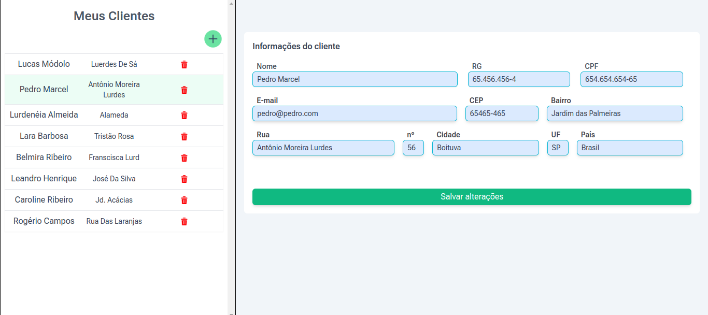

# Projeto para Cadastro de Clientes

<h1 align="center">
  
</h1>

> Projeto desenvolvido utilizando json-server como db para a prática de consumo de API (CRUD). A aplicação provê o cadastro de clientes, possibilitando posteriormente a edição das informações inseridas através de um formulário desenvolvido com a biblioteca React Hook Forms. Os campos do formulário possuem forte validação e também máscaras para garantir que as informações sejam enviadas corretamente.

## 💻 Pré-requisitos

Antes de começar, verifique se você atendeu aos seguintes requisitos:
* Você tem uma máquina `<Windows / Linux / Mac>`.
* Você tem o [git](https://git-scm.com) instalado na sua máquina.
* Você tem o [node](https://nodejs.org/en/) instalado na sua máquina.

## 🚀 Para visualizar

bash:
```
# Clone este repositório
$ git clone <https://github.com/vitorrdc/webClientRegister>
# Acesse a pasta do projeto no terminal/cmd
$ cd webClientRegister
# Instale as dependências
$ npm install ou yarn install
# Acesse a pasta do projeto no terminal/cmd
$ cd webClientRegister
# Execute a aplicação em modo de desenvolvimento
$ npm run dev ou yarn dev
# O servidor inciará na porta:3000
# Instale o json-server para usufruir do banco de dados
# Execute o mesmo na porta:3001
# Agora é só acessar o endereço http://localhost:3000 no Browser de sua preferência
```

### 🛠 Tecnologias

As seguintes ferramentas foram usadas na construção do projeto:
- [NextJS](https://nextjs.org/)
- [JavaScript](https://developer.mozilla.org/pt-BR/docs/Web/JavaScript)
- [TailwindCSS](https://tailwindcss.com/)
- [Json-Server](https://www.npmjs.com/package/json-server)
- [React-Hook-Form](https://react-hook-form.com/)
- [Zod](https://zod.dev/)

### 👨🏾‍💻 Autor
---

 

Feito com ❤️ por Vitor Ribeiro 👋🏽 Entre em contato!


[](mailto:vitor.camposrdc@gmail.com)
